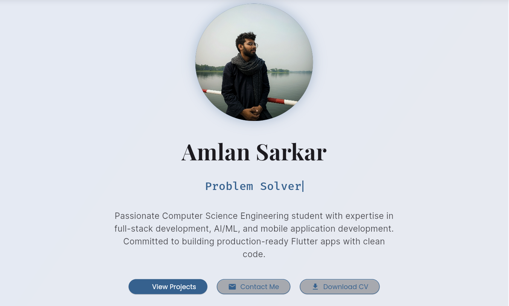
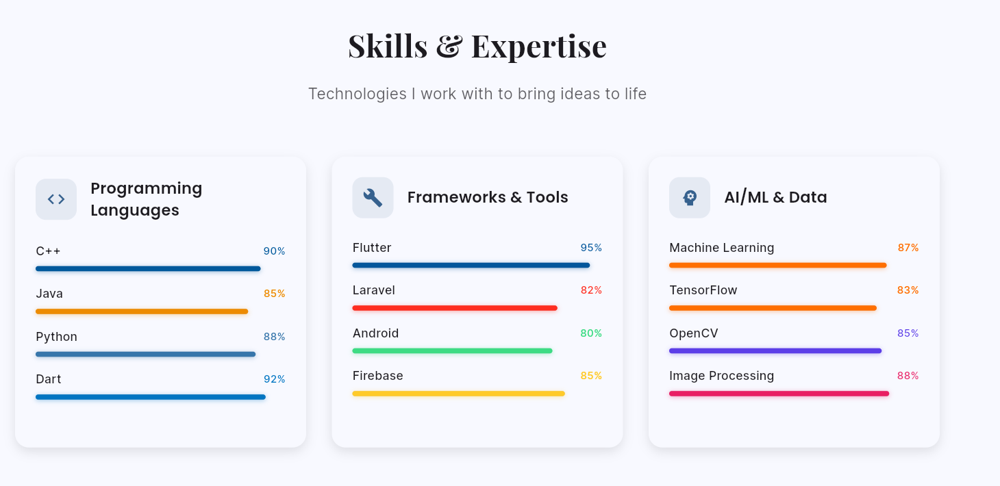
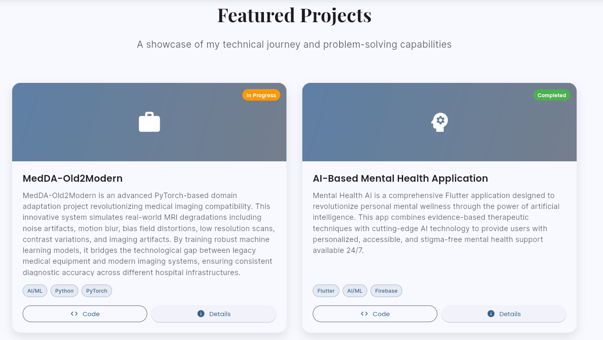
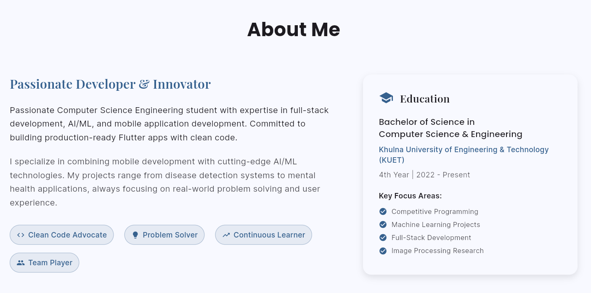
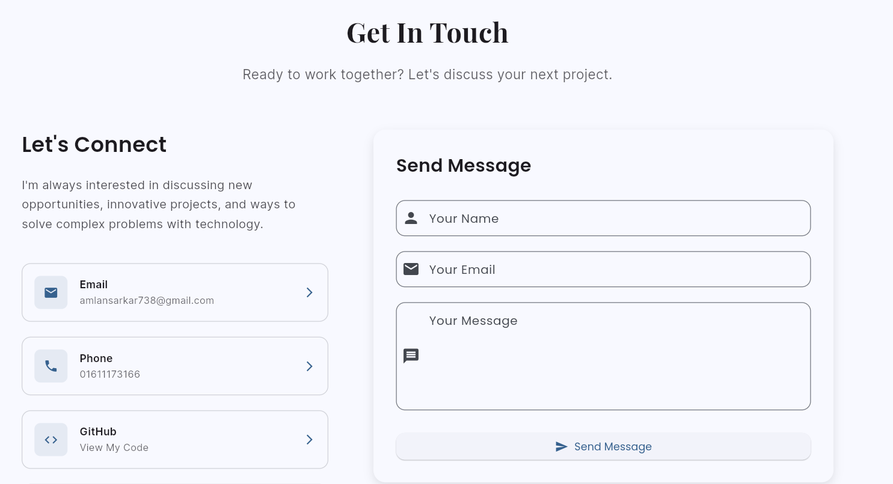

# 🚀 AmlanTechPortfolio

<div align="center">
  
[](https://flutter.dev)
[](https://dart.dev)
[](https://firebase.google.com)
[](https://tensorflow.org)

**A modern, responsive Flutter portfolio showcasing innovation in mobile development and AI/ML**

[🌐 Live Demo](https://your-portfolio-url.com) | [📱 Download APK](https://github.com/AmlanWTK/AmlanTechPortfolio/releases) | [📧 Contact](mailto:amlansarkar738@gmail.com)

</div>

---

## 🎯 **About This Portfolio**

AmlanTechPortfolio is a **production-ready Flutter web application** that demonstrates advanced mobile development skills, clean architecture, and modern design principles. Built from scratch with custom animations, responsive layouts, and seamless user experience across all devices.

### ✨ **What Makes It Special**

- 🎨 **Smooth Animations** - Custom typewriter effects, skill bar animations, and page transitions
- 📱 **Fully Responsive** - Perfect experience on mobile, tablet, and desktop
- 🌙 **Dark/Light Theme** - Toggle between beautiful themes with smooth transitions
- 🎪 **Interactive UI** - Hover effects, scroll-triggered animations, and engaging interactions
- 🏗️ **Clean Architecture** - MVVM pattern with Provider state management
- 🚀 **Modern Tech Stack** - Latest Flutter 3.0+ with Material 3 design system

---

## 📸 **Screenshots**

<div align="center">
  
| Hero Section | Skills Animation | Projects Showcase |
|:------------:|:---------------:|:----------------:|
|  |  |  |

| About | Mobile View | Contact Form |
|:---------:|:----------:|:------------:|
|  |  |  |

</div>

---

## 🛠️ **Technical Stack**

### **Frontend Framework**
```yaml
Flutter 3.24.0+
Dart 3.0+
Material Design 3
```

### **Key Dependencies**
```yaml
provider: ^6.1.1                    # State management
google_fonts: ^6.1.0               # Typography
url_launcher: ^6.2.1               # External links
flutter_staggered_animations: ^1.1.1  # Advanced animations
responsive_builder: ^0.7.0         # Responsive design
```

### **Architecture**
- **Pattern**: MVVM (Model-View-ViewModel)
- **State Management**: Provider
- **Navigation**: Custom smooth scroll with section detection
- **Theming**: Dynamic theme switching with persistence
- **Performance**: Optimized animations at 60fps

---

## 🚀 **Features Showcase**

### **🎨 Advanced Animations**
- **Typewriter Effect**: Rotating professional titles
- **Skill Bars**: Smooth fill animations on scroll
- **Staggered Reveals**: Section content appears with elegant timing
- **Hero Transitions**: Seamless navigation between sections

### **📱 Responsive Design**
- **Mobile First**: Touch-optimized interactions
- **Tablet Adaptive**: Grid layouts adjust to screen size
- **Desktop Enhanced**: Multi-column layouts with hover effects
- **Cross-Platform**: Consistent experience on web, Android, iOS

### **🎯 Professional Sections**
- **Hero**: Animated introduction with call-to-actions
- **About**: Personal story with education timeline
- **Skills**: Interactive progress bars with technology icons
- **Projects**: Detailed showcase with live demos and code links
- **Contact**: Working form with social media integration

---

## 🏗️ **Project Structure**

```
lib/
├── main.dart                    # App entry point
├── screens/
│   └── portfolio_screen.dart    # Main portfolio screen
├── widgets/
│   ├── hero_section.dart        # Animated hero section
│   ├── about_section.dart       # About me section
│   ├── skills_section.dart      # Interactive skills
│   ├── projects_section.dart    # Project showcase
│   ├── contact_section.dart     # Contact form
│   └── custom_app_bar.dart      # Navigation bar
├── providers/
│   └── theme_provider.dart      # Theme management
└── constants/
    └── app_constants.dart       # App configuration
```

---

## 📊 **Featured Projects**

### 🏥 **MedDA-Old2Modern** 
*AI-powered medical data modernization*
- **Tech**: PyTorch, Python, Medical Imaging
- **Impact**: Bridges legacy and modern medical equipment
- **Status**: In Development

### 🧠 **AI Mental Health App**
*Flutter + AI for mental wellness*
- **Tech**: Flutter, Firebase, TensorFlow Lite
- **Features**: Personalized recommendations, mood tracking
- **Status**: Completed

### ⚖️ **BanglaAiLaw**
*RAG system for legal document queries*
- **Tech**: Python, NLP, Constitutional Law
- **Features**: Bilingual legal assistance, document retrieval
- **Status**: Completed

### 🌍 **Tourism Blog Platform**
*Laravel-powered travel community*
- **Tech**: Laravel, MySQL, JavaScript
- **Features**: Content management, social networking
- **Status**: Completed

---

## 🚀 **Quick Start**

### **Prerequisites**
```bash
Flutter SDK >=3.0.0
Dart SDK >=3.0.0
```

### **Installation**
```bash
# Clone the repository
git clone https://github.com/AmlanWTK/AmlanTechPortfolio.git

# Navigate to project directory
cd AmlanTechPortfolio

# Install dependencies
flutter pub get

# Run on web
flutter run -d web

# Build for production
flutter build web --release
```

### **Deployment**
```bash
# Deploy to Firebase Hosting
firebase deploy

# Or deploy to GitHub Pages
flutter build web --base-href="/AmlanTechPortfolio/"
```

---

## 🎨 **Customization Guide**

### **Personal Information**
```dart
// lib/constants/app_constants.dart
class AppConstants {
  static const String name = 'Your Name';
  static const String title = 'Your Professional Title';
  static const String email = 'your.email@example.com';
  // ... add your details
}
```

### **Theme Colors**
```dart
// lib/providers/theme_provider.dart
static final _lightTheme = ThemeData(
  colorScheme: ColorScheme.fromSeed(
    seedColor: const Color(0xFF2196F3), // Change primary color
    brightness: Brightness.light,
  ),
);
```

### **Projects**
Update the projects array in `app_constants.dart` with your own projects, including descriptions, technologies, and GitHub links.

---

## 📱 **Device Compatibility**

| Platform | Status | Notes |
|----------|--------|-------|
| 🌐 **Web** | ✅ Full Support | Chrome, Firefox, Safari, Edge |
| 📱 **Android** | ✅ Full Support | Android 5.0+ (API 21+) |
| 🍎 **iOS** | ✅ Full Support | iOS 12.0+ |
| 🖥️ **Desktop** | ✅ Full Support | Windows, macOS, Linux |

---

## 🤝 **Contributing**

Contributions, issues, and feature requests are welcome!

1. **Fork** the repository
2. **Create** your feature branch (`git checkout -b feature/AmazingFeature`)
3. **Commit** your changes (`git commit -m 'Add some AmazingFeature'`)
4. **Push** to the branch (`git push origin feature/AmazingFeature`)
5. **Open** a Pull Request

---

## 📄 **License**

This project is licensed under the **MIT License** - see the [LICENSE](LICENSE) file for details.

---

## 👨‍💻 **About Developer**

<div align="center">

### **Amlan Sarkar**
*Flutter Developer | AI/ML Enthusiast*

🎓 **Computer Science Engineering** @ KUET  
🚀 **Passionate** about mobile development and artificial intelligence  
💡 **Focused** on creating innovative solutions that solve real-world problems  

[](https://github.com/AmlanWTK)
[](https://www.linkedin.com/in/amlan-sarkar-0b5667362/)
[](mailto:amlansarkar738@gmail.com)

</div>

---

## 🌟 **Show Your Support**

If this project helped you or inspired your own portfolio, please consider:

- ⭐ **Starring** this repository
- 🍴 **Forking** for your own version  
- 📢 **Sharing** with the developer community
- 💬 **Providing feedback** for improvements

---

## 📈 **Performance Metrics**

- ⚡ **Lighthouse Score**: 95+ (Performance, Accessibility, SEO)
- 🚀 **First Load Time**: < 3 seconds
- 📱 **Mobile Friendly**: 100% responsive design
- 🎨 **Animation Frame Rate**: Consistent 60fps
- 💾 **Bundle Size**: Optimized for fast loading

---

<div align="center">

**Built with ❤️ using Flutter**

*"Code is poetry written for machines, but appreciated by humans"*

---

© 2025 Amlan Sarkar. All rights reserved.

</div>
